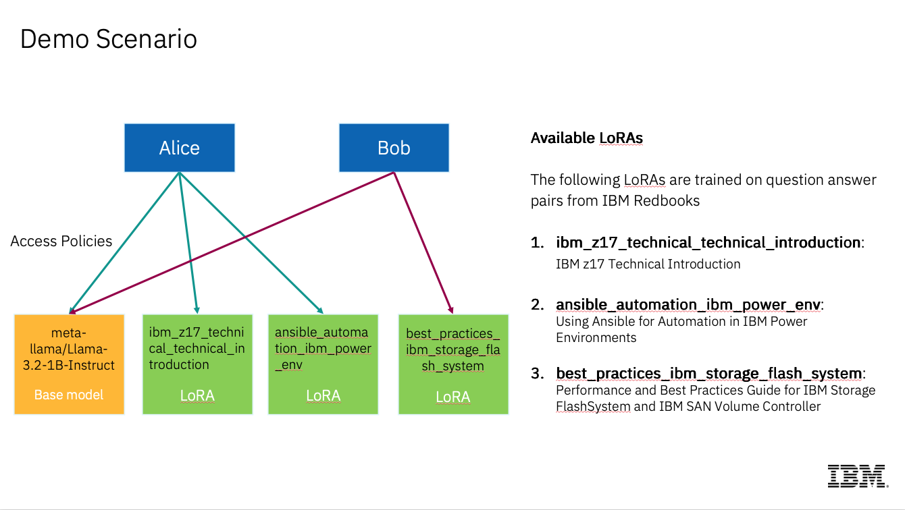

# Install secure-inference with llm-d CPU Inference in Minikube

This guide deploys llm-d with CPU-based model serving on minikube, featuring:

1. meta-llama/Llama-3.2-1B-Instruct model (real inference on CPU)
2. 3 LoRA adapters from HuggingFace (real fine-tuned adapters)
3. HTTPS enabled gateway (static TLS cert, no cert-manager needed)
4. secure-inference access control (JWT authentication + ABAC authorization)
5. Adapter selection sidecar (semantic LoRA routing via sentence-transformer embeddings)

> **Note:** This runs model inference on CPU via vLLM. Responses are slower than GPU (~10-30s per request). Uses the pre-built `ghcr.io/llm-d/llm-d-cpu:v0.6.0` image.

## System Requirements

| Resource | Minimum | Recommended |
|----------|---------|-------------|
| RAM      | 16 GB   | 32 GB       |
| CPU      | 6 cores | 8+ cores    |
| Disk     | 20 GB   | 30 GB       |

## Prerequisites

- [minikube](https://minikube.sigs.k8s.io/docs/start/)
- [Docker Desktop](https://www.docker.com/products/docker-desktop/) (or Docker Engine on Linux)
- [helm](https://helm.sh/docs/intro/install/)
- [kubectl](https://kubernetes.io/docs/tasks/tools/)
- [git](https://git-scm.com/)
- [go](https://go.dev/doc/install) (for building secure-inference)
- A [HuggingFace token](https://huggingface.co/settings/tokens) with access to `meta-llama/Llama-3.2-1B-Instruct` (gated model)

## Setup

```sh
cd ./guides/minikube-llm-d-cpu
```

Set your HuggingFace token (required for downloading the gated Llama model):

```sh
export HF_TOKEN="hf_your_token_here"
```

Run the setup:

```sh
./setup.sh
```

The script will take approximately 10-15 minutes to complete (longer on first run due to vLLM build) and will:

1. Pull the pre-built vLLM CPU image
2. Clone llm-d repository (latest kustomize-based architecture)
3. Install client tools (kustomize, istioctl, etc.)
4. Start Minikube cluster (10GB RAM, 6 CPUs)
5. Install Istio with Gateway API Inference Extension support
6. Generate a static TLS certificate (via `llmd-admin tls-cert`)
7. Deploy HTTPS Gateway via kustomize
8. Deploy llm-d scheduler (InferencePool) via OCI helm chart
9. Deploy model server with CPU vLLM + LoRA adapters (downloads from HuggingFace)
10. Build and deploy secure-inference (policy engine + CRD controllers + ext-auth gRPC server)
11. Build and deploy adapter selection sidecar
12. Apply sample access policies

## Testing with secure-inference

### Port Forward

```sh
kubectl port-forward svc/llm-d-cpu-inference-gateway-istio 8443:443 -n llm-d-cpu &
```

### Set Model

```sh
export MODEL="meta-llama/Llama-3.2-1B-Instruct"
# export MODEL="ibm_z17_technical_technical_introduction"
# export MODEL="ansible_automation_ibm_power_env"
# export MODEL="best_practices_ibm_storage_flash_system"
```

### Generate JWT Token

```sh
# alice (has access to z17 and Power LoRAs)
export JWT=$(cd ../../ && ./bin/llmd-admin create --name alice)

# charlie (has access to FlashSystem LoRA)
# export JWT=$(cd ../../ && ./bin/llmd-admin create --name charlie)
```

### Send an authenticated request

```sh
curl -vik --connect-to llm-d.com:443:localhost:8443 https://llm-d.com:443/v1/completions \
  --header "Authorization: Bearer $JWT" \
  --header "Content-Type: application/json" \
  --data '{
    "model": "'"$MODEL"'",
    "prompt": "What is Kubernetes?",
    "max_tokens": 100
}'
```

> **Note:** CPU inference is slow. Expect 10-30 seconds for a response.

### Test adapter selection (auto LoRA routing)

Send a request for the base model with a domain-specific prompt and the `x-adapter-selection: true` header. If a matching LoRA the user has access to is found, EPP rewrites the request body's `model:` field to the selected LoRA before forwarding to vLLM. EPP rewrites the response body's `model:` field back to the originally requested base model name, and no response header carries the LoRA name. See [Verifying adapter selection](#verifying-adapter-selection) below to check which LoRA ran.

```sh
# Alice asking about z17 — should auto-route to ibm_z17 LoRA
export JWT=$(cd ../../ && ./bin/llmd-admin create --name alice)
curl -vik --connect-to llm-d.com:443:localhost:8443 https://llm-d.com:443/v1/completions \
  --header "Authorization: Bearer $JWT" \
  --header "Content-Type: application/json" \
  --header "x-adapter-selection: true" \
  --data '{
    "model": "meta-llama/Llama-3.2-1B-Instruct",
    "prompt": "Explain the IBM z17 mainframe architecture",
    "max_tokens": 100
}'
```

```sh
# Charlie asking about FlashSystem — should auto-route to ibm_storage_flash LoRA
export JWT=$(cd ../../ && ./bin/llmd-admin create --name charlie)
curl -vik --connect-to llm-d.com:443:localhost:8443 https://llm-d.com:443/v1/completions \
  --header "Authorization: Bearer $JWT" \
  --header "Content-Type: application/json" \
  --header "x-adapter-selection: true" \
  --data '{
    "model": "meta-llama/Llama-3.2-1B-Instruct",
    "prompt": "What are best practices for IBM FlashSystem storage management?",
    "max_tokens": 100
}'
```

### Verifying adapter selection

The response body cannot tell you which LoRA was used (EPP rewrites it back). Use one of:

#### EPP logs

```sh
kubectl logs -n llm-d-cpu deployment/minikube-llm-d-cpu-epp --tail=50 \
  | grep "EPP sent request body response"
```

Each line contains `modelName` (what the client sent) and `targetModelName` (what EPP routed to). When they differ, a LoRA was selected. Match by `x-request-id`, which equals the response body's `id` field without the `cmpl-` prefix.

#### vLLM `lora_requests_info` metric

A per-LoRA gauge whose value is the unix-timestamp of the most recent request to use that LoRA. Snapshot before and after a request:

```sh
DECODE_POD=$(kubectl get pod -n llm-d-cpu -l llm-d.ai/role=decode -o jsonpath='{.items[0].metadata.name}')
kubectl exec -n llm-d-cpu $DECODE_POD -c modelserver -- \
  curl -s localhost:8000/metrics | grep '^vllm:lora_requests_info'
```

Sample output:

```
vllm:lora_requests_info{running_lora_adapters="ibm_z17_technical_technical_introduction",...} 1.779731246e+09
vllm:lora_requests_info{running_lora_adapters="best_practices_ibm_storage_flash_system",...} 1.779698754e+09
vllm:lora_requests_info{running_lora_adapters="ansible_automation_ibm_power_env",...}        1.779698742e+09
```

If a LoRA's timestamp advances into the time window of your request, that LoRA ran. Other LoRAs' timestamps stay frozen.

## Demo Scenario

The setup includes two users with role-based access control:

- **Alice** (systems_role): Can access base model, IBM z17 LoRA, and IBM Power LoRA
- **Charlie** (database_expert): Can access base model and IBM FlashSystem LoRA



## Architecture

This guide uses the new llm-d kustomize-based deployment:

- **Gateway**: Istio with Gateway API Inference Extension (HTTPS)
- **Scheduler**: llm-d InferencePool via OCI helm chart (load-aware routing)
- **Model Server**: vLLM CPU with LoRA adapters from HuggingFace
- **Auth**: secure-inference ext-auth (JWT + OPA ABAC)
- **LoRA Routing**: Adapter selection sidecar (semantic similarity)

## Troubleshooting

### Model server pod stuck in startup

CPU model loading takes 3-5 minutes. Check logs:

```sh
kubectl logs -n llm-d-cpu -l llm-d.ai/role=decode -f
```

### HuggingFace download fails

Ensure `HF_TOKEN` is set before running `setup.sh` and that your token has access to `meta-llama/Llama-3.2-1B-Instruct`.

### Slow inference

Expected on CPU. The 1B model on CPU produces ~1-5 tokens/second. This guide is for the access control and routing flow, not production performance.

## Cleanup

```sh
./cleanup.sh
```

This will uninstall all components, delete the minikube cluster, and remove the cloned llm-d directory.
