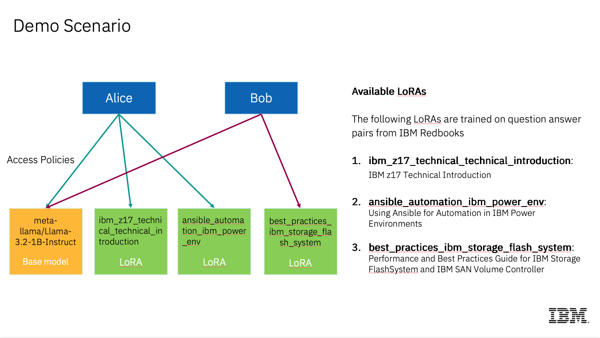

# Install secure-inference with llm-d Simulated Accelerators in minikube

This guide will help you install a minikube-based llm-d demo setup with simulated accelerators, featuring:

1. meta-llama/Llama-3.2-1B-Instruct model
2. 3 LoRAs: ibm_z17_technical_technical_introduction, ansible_automation_ibm_power_env, best_practices_ibm_storage_flash_system
3. HTTPS enabled gateway (static TLS cert, no cert-manager needed)
4. secure-inference access control (JWT authentication + ABAC authorization)
5. Adapter selection sidecar (semantic LoRA routing via sentence-transformer embeddings)

> **Note:** The adapter selection sidecar is deployed by default.
> It routes prompts to the best-matching LoRA adapter when the user
> has access. Include `x-adapter-selection: true` in your request
> to trigger it.

## Setup minikube environment

```sh
cd ./guides/minikube-llm-d-sim
```

```sh
./setup.sh
```

The script will take approximately 15-20 minutes to complete and will:

1. Clone llm-d repository
2. Patch gateway and model service configurations (Go scripts)
3. Start Minikube cluster
4. Generate a static TLS certificate (via `llmd-admin tls-cert`)
5. Install llm-d with simulated accelerators using istio gateway with HTTPS listener
6. Build and deploy secure-inference (unified binary: policy engine + CRD controllers + ext-auth gRPC server)
7. Build and deploy adapter selection sidecar
8. Apply sample access policies

This setup follows the [Simulated Accelerators guide](https://github.com/llm-d/llm-d/tree/main/guides/simulated-accelerators) with secure-inference integration.

## Testing with secure-inference

### Port Forward

```sh
kubectl port-forward svc/infra-sim-inference-gateway-istio 8443:443 -n llm-d-sim &
```

### Set Model

```sh
export MODEL="meta-llama/Llama-3.2-1B-Instruct"
# export MODEL="ibm_z17_technical_technical_introduction"
# export MODEL="ansible_automation_ibm_power_env"
# export MODEL="best_practices_ibm_storage_flash_system"
```

### Generate JWT Token

```sh
# alice (has access to z17 and Power LoRAs)
export JWT=$(cd ../../ && ./bin/llmd-admin create --name alice)

# bob (has access to FlashSystem LoRA)
# export JWT=$(cd ../../ && ./bin/llmd-admin create --name bob)
```

### Send an authenticated request

```sh
curl -vik --connect-to llm-d.com:443:localhost:8443 https://llm-d.com:443/v1/completions \
  --header "Authorization: Bearer $JWT" \
  --header "Content-Type: application/json" \
  --data '{
    "model": "'"$MODEL"'",
    "prompt": "What is Kubernetes?",
    "max_tokens": 100
}'
```

### Test adapter selection (auto LoRA routing)

Send a request for the base model with a domain-specific prompt and the `x-adapter-selection: true` header. If a matching LoRA the user has access to is found, the response header `x-gateway-model-name-rewrite` will contain the selected LoRA model ID.

```sh
# Alice asking about z17 — should auto-route to ibm_z17 LoRA
export JWT=$(cd ../../ && ./bin/llmd-admin create --name alice)
curl -vik --connect-to llm-d.com:443:localhost:8443 https://llm-d.com:443/v1/completions \
  --header "Authorization: Bearer $JWT" \
  --header "Content-Type: application/json" \
  --header "x-adapter-selection: true" \
  --data '{
    "model": "meta-llama/Llama-3.2-1B-Instruct",
    "prompt": "Explain the IBM z17 mainframe architecture",
    "max_tokens": 100
}'
```

```sh
# Bob asking about FlashSystem — should auto-route to ibm_storage_flash LoRA
export JWT=$(cd ../../ && ./bin/llmd-admin create --name bob)
curl -vik --connect-to llm-d.com:443:localhost:8443 https://llm-d.com:443/v1/completions \
  --header "Authorization: Bearer $JWT" \
  --header "Content-Type: application/json" \
  --header "x-adapter-selection: true" \
  --data '{
    "model": "meta-llama/Llama-3.2-1B-Instruct",
    "prompt": "What are best practices for IBM FlashSystem storage management?",
    "max_tokens": 100
}'
```

## Demo Scenario

The setup includes two users with role-based access control:

- **Alice** (systems_role): Can access base model, IBM z17 LoRA, and IBM Power LoRA
- **Bob** (database_expert): Can access base model and IBM FlashSystem LoRA



## Cleanup

```sh
./cleanup.sh
```

This will delete the minikube cluster and remove the cloned llm-d directory.
